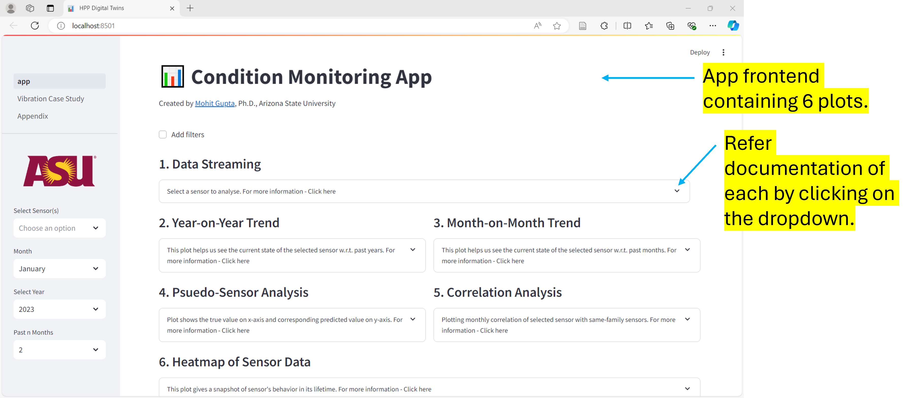

# Condition Monitoring App

This repo contains an app created to monitor the condition of turbines in Hydro-Electric Power Stations. 
Plots in the app are selected after their thorough evaluation of usability and relevance by field engineers.
The app also contains detailed explanation and utility of each plot alongside a case study on vibration monitoring.

*Note:* Dataset is proprietary, and hence not shared. Though, a small subset is shared for utility purpose. 
*You are free to use the app or modify as needed...*

#### A. Overview of App

#### B. Plot 1 -  Streaming Data

#### C. Plot 2 & 3 -  Capturing Year-on-Year & Month-on-Month Trend

#### D. Plot 4 -  Psuedo-Sensor Analysis (Hidden due to privacy concerns)

#### E. Plot 5 -  Correlation Analysis 

#### F. Plot 6 -  Heatmap  

#### G. Case-study: Vibration Analysis in Hydro-Turbine  

** Many features in the app were not allowed to be shared publicly, hence are not included in the public version.**

